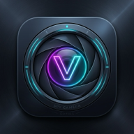

# V Spy Camera - Unlimited Free Recordings 🎥



A modern, high-performance Android background video recorder application built with **Jetpack Compose**, **CameraX**, **AdMob SDK**, and **Media3 ExoPlayer**. Record high-quality videos in the background with **unlimited free recording time**, customizable resolution options (Highest, 1080p, 720p, 480p), front/back camera toggles, smart alarm scheduler, and custom disguised notifications.

---

## 🌟 Key Features

- **Unlimited Free Background Recording:** Record video secretly without time limits or subscriptions.
- **Camera Selection:** Switch seamlessly between **Front Camera** and **Back Camera**.
- **Quality Controls:** Select preferred video resolution (Highest/Full HD 1080p, HD 720p, SD 480p).
- **AdMob Monetization Ready:** Integrated with AdMob Banner, App Open (on startup), and Interstitial ads (on stop & app exit).
- **Smart Alarm Scheduler:** Schedule auto-record sessions for any future date, time, and duration using Android's `AlarmManager`.
- **Disguised Notifications:** Customize notification title and content (e.g. "System Update") to keep active recording discreet.
- **In-App HD Player:** Built-in video gallery with async thumbnail generation, full-screen playback powered by **ExoPlayer**, and 1-tap share/delete options.
- **Strict Local Storage & Privacy:** All recorded videos are saved directly to device storage (`DCIM/SecretVideoRecorder`). No data or media is uploaded to any cloud server.

---

## 📱 Tech Stack & Architecture

- **UI Framework:** Jetpack Compose (Material 3 Dark Obsidian & Neon Theme)
- **Camera Engine:** AndroidX CameraX (Core, Camera2, Lifecycle, Video)
- **Background Engine:** AndroidX Lifecycle Service & Foreground Service
- **Scheduler:** `AlarmManager` with `BroadcastReceiver` for boot-resilient tasks
- **Monetization:** Google Play Services Ads (AdMob SDK)
- **Video Playback:** AndroidX Media3 ExoPlayer
- **Target SDK:** 34 (Android 14) | **Min SDK:** 24 (Android 8.0)

---

## 📄 Play Store Compliance & Reviewer Documents

This repository contains all documentation required for **Google Play Store submission and review approval**:

- 📜 [**PRIVACY_POLICY.md**](./PRIVACY_POLICY.md) - Official Privacy Policy document.
- 🌐 [**privacy_policy.html**](./privacy_policy.html) - Production HTML Privacy Policy (ready for GitHub Pages).
- 📝 [**PLAYSTORE_LISTING.md**](./PLAYSTORE_LISTING.md) - Play Store Title, Short Description, Full Description, and Metadata.
- 🔒 [**DATA_SAFETY_DECLARATION.md**](./DATA_SAFETY_DECLARATION.md) - Exact Google Play Console Data Safety questionnaire responses.

---

## 🛠️ How to Build & Run

### Prerequisites
- Android Studio Ladybug / Jellyfish or newer
- JDK 17+
- Android SDK 34

### Building via Command Line
```bash
# Clone the repository
git clone https://github.com/ultraspeakai-maker/myapps.git
cd myapps

# Build Debug APK
./gradlew assembleDebug

# Build Production Release Bundle (AAB) for Play Store
./gradlew bundleRelease
```

The compiled Debug APK will be generated at:  
`app/build/outputs/apk/debug/app-debug.apk`

---

## 🌐 Public Repository & Contact

- **GitHub Repository:** [https://github.com/ultraspeakai-maker/myapps](https://github.com/ultraspeakai-maker/myapps)
- **Application Package ID:** `com.camera.secretvideorecorder`
- **License:** Open Source / Commercial Play Store Distribution Ready
